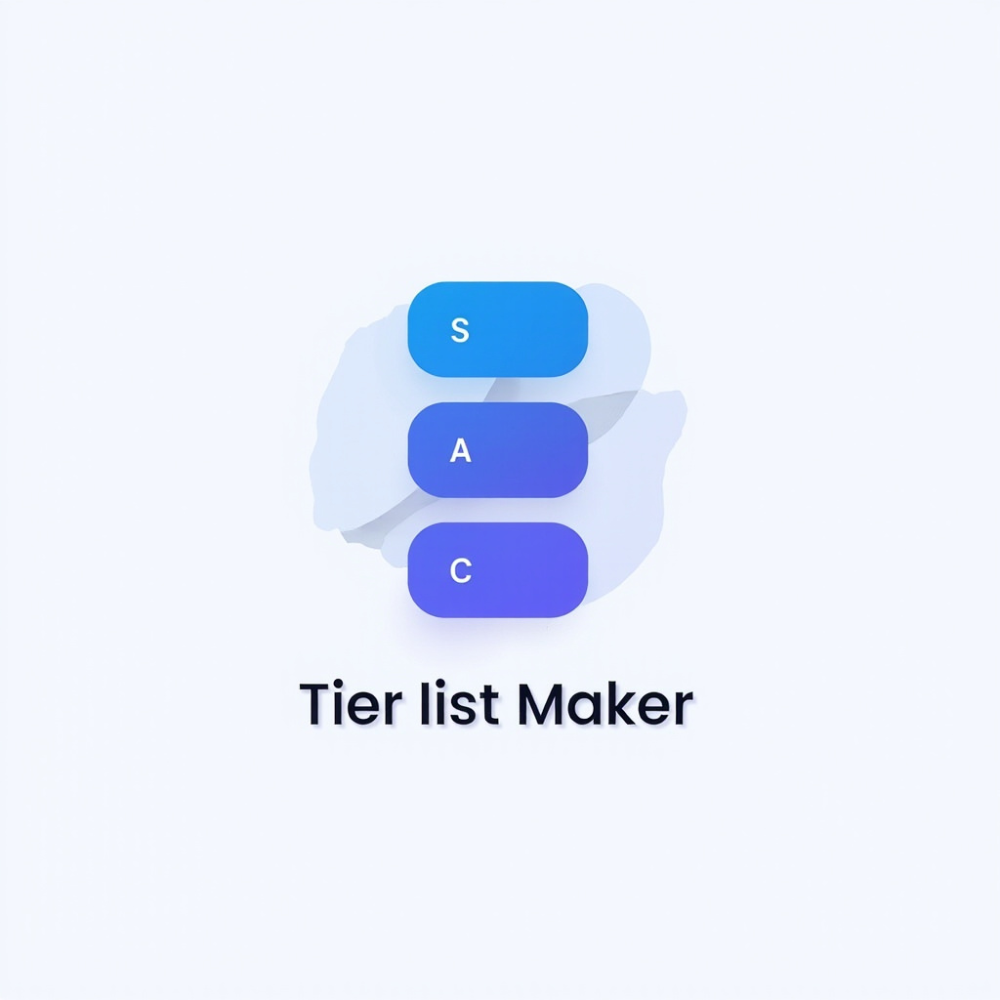

# Tier List Maker Two

<div align="center">
  
  
  **Create and share your custom tier lists with drag & drop functionality**

  [🌐 Live Demo](https://tierlistmakertwo.top/) • [📖 Documentation](#features) • [🐛 Report Bug](https://github.com/SymphonyIceAttack/tier-list-maker-two/issues) • [💡 Request Feature](https://github.com/SymphonyIceAttack/tier-list-maker-two/issues)
</div>

## 📋 Table of Contents

- [Features](#features)
- [Demo](#demo)
- [Getting Started](#getting-started)
- [Usage](#usage)
- [Development](#development)
- [Deployment](#deployment)
- [Contributing](#contributing)
- [License](#license)
- [Support](#support)

## ✨ Features

- **🎯 Drag & Drop Interface**: Intuitive drag-and-drop functionality for creating tier lists
- **🌍 Multi-language Support**: Supports 7 languages (English, 中文, Français, Español, Русский, Deutsch, 日本語)
- **🎨 Theme Support**: Light/dark theme toggle for comfortable usage
- **📱 Responsive Design**: Works seamlessly on desktop, tablet, and mobile devices
- **💾 Export Options**: Export your tier lists as high-quality images
- **🖼️ Image Upload**: Easy image upload and management
- **🔄 Real-time Updates**: Instant updates as you organize your tiers
- **☁️ Cloudflare Powered**: Deployed on Cloudflare for global performance
- **📊 Multiple Tier Levels**: Standard S/A/B/C/D tier structure
- **🎛️ Customizable**: Modify tier labels and styling

## 🎮 Demo

Visit our live demo at [https://tierlistmakertwo.top/](https://tierlistmakertwo.top/) to try it out!

## 🚀 Getting Started

### Prerequisites

- Node.js 18+ 
- npm, yarn, pnpm, or bun

### Installation

1. **Clone the repository**
   ```bash
   git clone https://github.com/SymphonyIceAttack/tier-list-maker-two.git
   cd tier-list-maker-two
   ```

2. **Install dependencies**
   ```bash
   npm install
   # or
   yarn install
   # or
   pnpm install
   # or
   bun install
   ```

3. **Run the development server**
   ```bash
   npm run dev
   # or
   yarn dev
   # or
   pnpm dev
   # or
   bun dev
   ```

4. **Open your browser**
   
   Navigate to [http://localhost:3000](http://localhost:3000)

## 📖 Usage

1. **Add Images**: Click "Add Images" to upload your images
2. **Drag & Drop**: Drag images from the unassigned pool to your desired tier
3. **Export**: Click "Export" to save your tier list as an image
4. **Customize**: Use the theme toggle for light/dark mode
5. **Language**: Switch between 7 supported languages

## 🛠️ Development

### Tech Stack

- **Frontend**: Next.js 16, React 19, TypeScript
- **Styling**: Tailwind CSS, Radix UI
- **Drag & Drop**: @dnd-kit
- **Image Processing**: html2canvas
- **Deployment**: Cloudflare (Workers + Pages)
- **CMS**: Directus
- **Code Quality**: Biome, TypeScript

### Available Scripts

```bash
# Development
npm run dev              # Start development server
npm run build            # Build for production
npm run start            # Start production server

# Code Quality
npm run lint             # Run Biome linting
npm run format           # Format code with Biome

# Cloudflare Deployment
npm run build:worker     # Build for Cloudflare Workers
npm run preview          # Preview Cloudflare deployment
npm run deploy           # Deploy to Cloudflare
npm run upload           # Upload to Cloudflare

# Type Generation
npm run cf-typegen       # Generate Cloudflare types
```

### Project Structure

```
tier-list-maker-two/
├── app/                  # Next.js app directory
│   ├── (defautlang)/     # Default language routes
│   ├── (lang)/[lang]/    # Multi-language routes
│   └── api/              # API routes
├── components/           # React components
│   ├── ui/              # UI components
│   └── blog/            # Blog components
├── lib/                 # Utility libraries
│   ├── translations/    # Multi-language translations
│   └── constants.ts     # App constants
├── public/              # Static assets
└── ...config files
```

### Multi-language Setup

The project supports 7 languages:
- `en` - English (default)
- `zh` - 中文
- `fr` - Français  
- `es` - Español
- `ru` - Русский
- `de` - Deutsch
- `ja` - 日本語

Default language (`en`) uses root path `/`, while other languages use `/[lang]` paths.

## 🌐 Deployment

### Cloudflare Deployment

This project is optimized for Cloudflare deployment:

1. **Build for Cloudflare Workers**
   ```bash
   npm run build:worker
   ```

2. **Preview deployment**
   ```bash
   npm run preview
   ```

3. **Deploy to Cloudflare**
   ```bash
   npm run deploy
   ```

### Environment Variables

Configure the following for production:

- `DIRECTUS_URL`: Your Directus CMS instance URL
- `DIRECTUS_TOKEN`: Directus API token for content management

## 🤝 Contributing

We welcome contributions! Here's how you can help:

1. **Fork the repository**
2. **Create a feature branch** (`git checkout -b feature/amazing-feature`)
3. **Commit your changes** (`git commit -m 'Add amazing feature'`)
4. **Push to the branch** (`git push origin feature/amazing-feature`)
5. **Open a Pull Request**

### Development Guidelines

- Follow the existing code style
- Ensure all linting checks pass (`npm run lint`)
- Format code before committing (`npm run format`)
- Add tests for new features
- Update documentation as needed

### Areas for Contribution

- 🌍 **New Languages**: Add translations for more languages
- 🎨 **UI/UX Improvements**: Enhance the user interface
- ⚡ **Performance**: Optimize loading and rendering
- 🐛 **Bug Fixes**: Help fix reported issues
- 📱 **Mobile Experience**: Improve mobile responsiveness
- 🔧 **Features**: Add new tier list features

## 📄 License

This project is licensed under the MIT License - see the [LICENSE](LICENSE) file for details.

## 🙏 Acknowledgments

- [Next.js](https://nextjs.org/) for the amazing React framework
- [Tailwind CSS](https://tailwindcss.com/) for utility-first styling
- [@dnd-kit](https://dndkit.com/) for drag and drop functionality
- [Cloudflare](https://cloudflare.com/) for hosting and performance
- [Directus](https://directus.io/) for content management
- All contributors who help improve this project

## 🐛 Bug Reports & Feature Requests

- **Bug Reports**: [GitHub Issues](https://github.com/SymphonyIceAttack/tier-list-maker-two/issues)
- **Feature Requests**: [GitHub Issues](https://github.com/SymphonyIceAttack/tier-list-maker-two/issues)

## 📞 Support

- **Website**: [https://tierlistmakertwo.top/](https://tierlistmakertwo.top/)
- **GitHub**: [https://github.com/SymphonyIceAttack/tier-list-maker-two](https://github.com/SymphonyIceAttack/tier-list-maker-two)
- **Issues**: [GitHub Issues](https://github.com/SymphonyIceAttack/tier-list-maker-two/issues)

---

<div align="center">

Made with ❤️ by [SymphonyIceAttack](https://github.com/SymphonyIceAttack)

[⬆ Back to Top](#tier-list-maker-two)

</div>